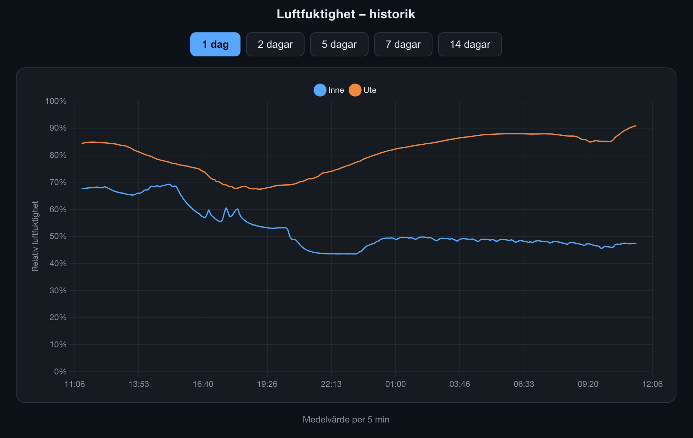

# signalk-humidity-history

A Signal K webapp that charts **relativeHumidity** history straight from the
local InfluxDB, with buttons to pick the time range (1 / 2 / 5 / 7 / 14 days).

Built for *Libelle*, where two Ruuvi tags publish
`environment.inside.relativeHumidity` and `environment.outside.relativeHumidity`
(ratio 0–1), logged to InfluxDB 1.x by `signalk-to-influxdb`.



## How it works

- The **plugin** exposes one REST endpoint,
  `GET /signalk/v1/api/humidity-history/data?days=N`, which runs the InfluxDB
  query **server-side** and returns downsampled series. No database credentials
  ever reach the browser.
- The endpoint is registered via `plugin.signalKApiRoutes` (under
  `/signalk/v1/api`), **not** `registerWithRouter` (under `/plugins`). The server
  guards every `/plugins/*` route with admin authentication, so a plain webapp —
  even with a device token — gets 401 there. Routes under `/signalk/v1/api`
  instead honour the server's *Allow readonly access* setting, so the same
  anonymous browser that can read the live values can also read their history.
  (The same handler is also mounted under `/plugins/signalk-humidity-history/data`
  for admin/OpenAPI tooling.)
- The query uses `mean("value")*100` with a `GROUP BY time(...)` interval scaled
  to the range, so 14 days returns a few hundred points instead of millions.
  Values come back as percent.
- The **webapp** (`public/index.html`) draws the series with a locally bundled
  Chart.js (`public/vendor/chart.umd.js`), so it works offline on the boat. The
  x-axis is a plain linear epoch-ms scale — no date adapter needed.

## Configuration (Admin → Server → Plugin Config)

| Option | Default | Notes |
|---|---|---|
| InfluxDB host | `localhost` | The plugin runs on the same Pi as InfluxDB. |
| InfluxDB port | `8086` | |
| InfluxDB database | `libelle` | |
| Username / password | *(blank)* | Only needed if InfluxDB auth is enabled. |
| Series | inside + outside | Each entry is one measurement (a Signal K path) plus a legend label. |

InfluxDB 1.x stores each Signal K path as its own measurement, with the sample
in the `value` column — so any path that `signalk-to-influxdb` records can be
charted by adding it to the Series list.

## Webapp

Available in the Admin UI under **Webapps**, or directly at
`/signalk-humidity-history/`.

## Install (folder-based, on the Pi)

```sh
cd ~/.signalk
npm install /home/boat/signalk-humidity-history
sudo systemctl restart signalk
```

No build step and no npm dependencies — the plugin uses Node's built-in
`fetch` (Node ≥ 18). Enable the plugin in the Admin UI after restarting.
